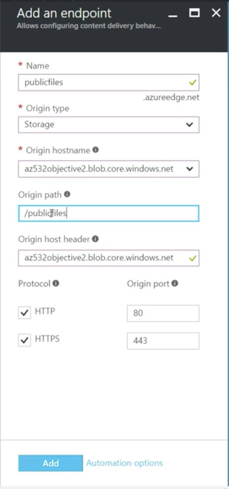

Input from facebook
-------------------
First attempt at the 70-532 yesterday. Scored 675. I was so close! There were about 60-70% coding related questions on Service Fabric, Tuning Cosmos DB, ARM templates parameters, Active Directory B2B and B2C, Mobile App Services. There were also questions on the Open source Paas offering such as Pivotal Cloud Foundry, Open Shift etc. I have already scheduled my 2nd attempt in the next two weeks. Here is my plan to study:

1) Go deeper in the Service Fabric coding, Deploy and debug stateful services using reliable dictionary, stateless services, and Actor services
2) Deploy the evaluation offering of Pivotal Cloud Foundry and Open Shift as these offering consume a 30-40 VMS
3) Go deeper in the ARM template deployment and understand the structure
4) Deploy application using COSMOS DB and understand what's involved in tuning when there are performance issue
5) Study the query language for Application Insight analysis tool

I welcome any other suggestion. Thanks.

VM disks 
---------
By default a VM contain an OS disk and data disks can be added after. OS disks have caching enabled by default. 
Caching is not an optimal solution when I/O requests are random.
Caching is an optimal solution when I/O requests are seuquential.

Scale a VM
-----------

Just pick your Virtual Machine go to size and you can it up or scale it down


VM Scale sets
--------------
- You can alocate a bunch of virtual machines
- You can pick the number of instances you want, a domain name and a IP adress
- You can pick na autoscale sale strategy based on cpu perecentage threshold usage, and between to say 3 to 6 VMs

Notes in the test
------------------

Action element prop types
https://docs.microsoft.com/en-us/iis/extensions/url-rewrite-module/url-rewrite-module-configuration-reference


SSD VMS
-------
- You can add a second data disk when you create a VM and define the caching (Read, Read/Write, None)

Azure storage replication
-------------------------
https://docs.microsoft.com/en-us/azure/storage/common/storage-redundancy


Monitor ARM VMs
---------------
- There are some metrics you can check
- You can create an alert when a metric is greater than...
- Notify owners/contributors and readers or add the emails manually
- Or trigger a webhook or run a "Runbook" - an automation task for this alert  

Design and Implement a Storage and Data Strategy (25-30%)
----------------------------------------------------------
**Implement Azure Storage blobs and Azure Files**  
- Storage account Premium is with SSD drive which is faster but more expensive
- Check the access keys to get access to the blob storage

- FetchAttributes downloads the attributes of the container

Access blods securely:
- With shared access signature you can limit the access that you Access keys will have
- If you have an intermediate service that access the blob so that you don't access the blob directly from the application can give you more control if you want to switch blobs.

Implement async blob copy:
```csharp
static void CopyBlob(CloudBlobContainer container)
{
  CloudBlockBlob blockBlob = container.GetBlockBlobReference("examobjectives");
  CloudBlockBlob copyToBlockBlob = container.GetBlockBlobReference("examobjectives-copy");
  copyToBlockBlob.StartCopyAsync(new Uri(blockBlob.Uri.AbsoluteUri));
}
```

Configure Content Delivery Network  (CDN)
- We can create a new CDN to serve files, which is a resource, and add an endpoint to it. 
- We pick a name for our endpoint (a unique url - something..azureedge.net), an origin type (at this point we'll choose "Storage"). We choose an origin hostname, an origin path (should be the name of the container)  

- So now we can hit directly the url publicfiles.azureedge.net/nameofourfile.pdf and download the file

Design Blob Hierarchies (create directories - subdirectories)

```csharp
static void UploadBlobSubdirectory(CloudBlobContainer container)
{
  CloudBlobDirectory directory = container.GetDirectoryReference("parent-directory");
  CloudBlockBlob blockBlob = directory.GetBlockBlobReference("newexamobjectives");
  CloudBlockBlob blockBlob = subdirectory.GetBlockBlobReference("newexamobjectives");

  using (var fileStream = System.IO.File.OpenRead(@"LOCAL_PATH"))
  {
    blockBlob.UploadFromStream(fileStream);
  }
}
```

Configure Custom Domains

- You can customize the domain through CNAME record and the setting is in Azure Portal.
